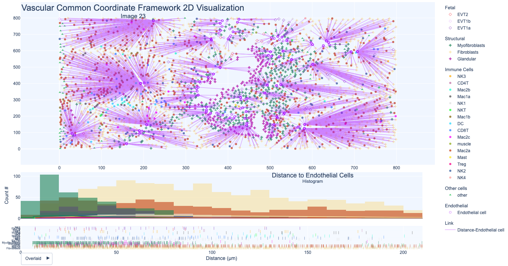
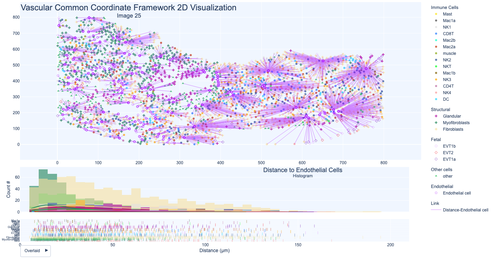
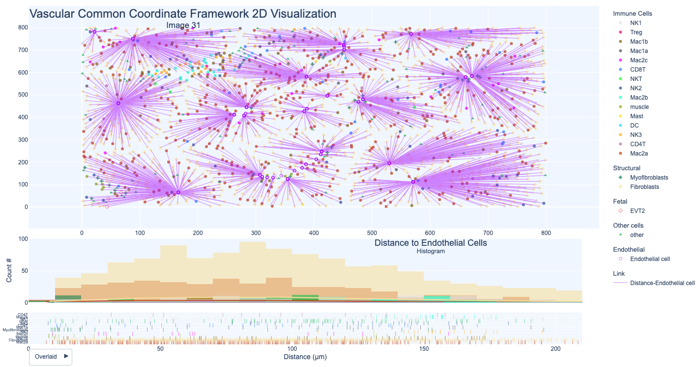
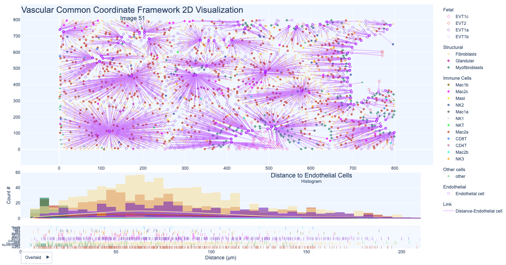

#  Preview: Vasculature CCF Visualization for Maternal-Fetal interface Data

HuBMAP Atlas Previews demonstrate functionality and resources that will become available in future HuBMAP portal releases. Previews may rely on externally hosted data or analysis results that were generated with processing pipelines that are not yet integrated into the HuBMAP data infrastructure.

### Description

This preview showcases a novel visualization in support of a vasculature-based common coordinate system (VCCF), see paper on “[Spatiotemporal coordination at the maternal-fetal interface promotes trophoblast invasion and vascular remodeling in the first half of human pregnancy](https://doi.org/10.1101/2021.09.08.459490)”.

Experimental data from the “[Spatiotemporal coordination at the maternal-fetal interface promotes trophoblast invasion and vascular remodeling in the first half of human pregnancy](https://doi.org/10.1101/2021.09.08.459490)” paper, is used to compute distances of different cell types to the nearest blood vessel using 2D volumes of digital Maternal-Fetal Interface biopsy data. Used optimized neural network for decidua-specific segmentation by training with 163 93,000 manually annotated single cell events from 25 decidual images, 15 of them from 164 our cohort.  Applying this segmentation algorithm to our cohort images yielded 495,349 165 segmented cells in total, identified across 211 images (800μmx800μm, 2347±783 cells 166 per image). Generated using 66 patients between 6-20 weeks of gestation, integrating this with coregistered transcriptomic profiles. Gestational age substantially influenced the frequency of many maternal immune and stromal cells, with tolerogenic subsets expressing CD206, CD163, TIM-3, Galectin-9, and IDO-1 increasingly enriched and colocalized at later time points. Each cell has its cell lineage, cellular neighborhood, community of neighborhooods, and tissue unit defined with x, y coordinates representing pixel location in the original image. 

### Atlas Details

This Preview showcases a 2D interactive visualization of distances from cell nuclei of different cell lineages to vasculature across donor groups.  

### Experimental Data Details

The experimental intestine data used here is detailed in the “[Spatiotemporal coordination at the maternal-fetal interface promotes trophoblast invasion and vascular remodeling in the first half of human pregnancy](https://www.biorxiv.org/content/10.1101/2021.09.08.459490v1.full.pdf)” paper.

### Contributors
**Placenta Data:** Michael Angelo et al.

**Vasculature CCF Visualization:** Himani Shah, Yingnan Ju & Katy Börner

### Attribution

| Group  | Creator                          |
|--------|----------------------------------|
| TMC-Stanford | Michael Angelo (mangelo0@stanford.edu) |
| MC-IU  | Katy Börner (katy@indiana.edu)   |

### Visualization

  <ul class="nav nav-tabs">
    <li class="active"><a data-toggle="tab" href="#Image1">Image 1</a></li>
    <li><a data-toggle="tab" href="#Image2">Image 2</a></li>
    <li><a data-toggle="tab" href="#Image3">Image 3</a></li>
    <li><a data-toggle="tab" href="#Image4">Image 4</a></li>
    <li><a data-toggle="tab" href="#Image5">Image 5</a></li>
    <li><a data-toggle="tab" href="#Image6">Image 6</a></li>
    <li><a data-toggle="tab" href="#Image7">Image 7</a></li>
    <li><a data-toggle="tab" href="#Image8">Image 8</a></li>
    <li><a data-toggle="tab" href="#Image9">Image 9</a></li>
    <li><a data-toggle="tab" href="#Image10">Image 10</a></li>
    <li><a data-toggle="tab" href="#Image11">Image 11</a></li>
    <li><a data-toggle="tab" href="#Image12">Image 12</a></li>
    <li><a data-toggle="tab" href="#Image13">Image 13</a></li>
    <li><a data-toggle="tab" href="#Image14">Image 14</a></li>
    <li><a data-toggle="tab" href="#Image15">Image 15</a></li>
    <li><a data-toggle="tab" href="#Image16">Image 16</a></li>
    <li><a data-toggle="tab" href="#Image17">Image 17</a></li>
    <li><a data-toggle="tab" href="#Image18">Image 18</a></li>
    <li><a data-toggle="tab" href="#Image19">Image 19</a></li>
    <li><a data-toggle="tab" href="#Image20">Image 20</a></li>
    <li><a data-toggle="tab" href="#Image21">Image 21</a></li>
    <li><a data-toggle="tab" href="#Image22">Image 22</a></li>
    <li><a data-toggle="tab" href="#Image23">Image 23</a></li>
    <li><a data-toggle="tab" href="#Image24">Image 24</a></li>
    <li><a data-toggle="tab" href="#Image25">Image 25</a></li>
    <li><a data-toggle="tab" href="#Image26">Image 26</a></li>
    <li><a data-toggle="tab" href="#Image27">Image 27</a></li>
    <li><a data-toggle="tab" href="#Image28">Image 28</a></li>
    <li><a data-toggle="tab" href="#Image29">Image 29</a></li>
    <li><a data-toggle="tab" href="#Image30">Image 30</a></li>
    <li><a data-toggle="tab" href="#Image31">Image 31</a></li>
    <li><a data-toggle="tab" href="#Image32">Image 32</a></li>
    <li><a data-toggle="tab" href="#Image33">Image 33</a></li>
    <li><a data-toggle="tab" href="#Image34">Image 34</a></li>
    <li><a data-toggle="tab" href="#Image35">Image 35</a></li>
    <li><a data-toggle="tab" href="#Image36">Image 36</a></li>
    <li><a data-toggle="tab" href="#Image37">Image 37</a></li>
    <li><a data-toggle="tab" href="#Image38">Image 38</a></li>
    <li><a data-toggle="tab" href="#Image39">Image 39</a></li>
    <li><a data-toggle="tab" href="#Image40">Image 40</a></li>
    <li><a data-toggle="tab" href="#Image41">Image 41</a></li>
    <li><a data-toggle="tab" href="#Image42">Image 42</a></li>
    <li><a data-toggle="tab" href="#Image43">Image 43</a></li>
    <li><a data-toggle="tab" href="#Image44">Image 44</a></li>
    <li><a data-toggle="tab" href="#Image45">Image 45</a></li>
    <li><a data-toggle="tab" href="#Image46">Image 46</a></li>
    <li><a data-toggle="tab" href="#Image47">Image 47</a></li>
    <li><a data-toggle="tab" href="#Image48">Image 48</a></li>
    <li><a data-toggle="tab" href="#Image49">Image 49</a></li>
    <li><a data-toggle="tab" href="#Image50">Image 50</a></li>
    <li><a data-toggle="tab" href="#Image51">Image 51</a></li>
    <li><a data-toggle="tab" href="#Image52">Image 52</a></li>
    <li><a data-toggle="tab" href="#Image53">Image 53</a></li>
    <li><a data-toggle="tab" href="#Image54">Image 54</a></li>
    <li><a data-toggle="tab" href="#Image55">Image 55</a></li>
    <li><a data-toggle="tab" href="#Image56">Image 56</a></li>
    <li><a data-toggle="tab" href="#Image57">Image 57</a></li>
    <li><a data-toggle="tab" href="#Image58">Image 58</a></li>
    <li><a data-toggle="tab" href="#Image59">Image 59</a></li>
    <li><a data-toggle="tab" href="#Image61">Image 60</a></li>
    <li><a data-toggle="tab" href="#Image61">Image 61</a></li>
    <li><a data-toggle="tab" href="#Image62">Image 62</a></li>
    <li><a data-toggle="tab" href="#Image63">Image 63</a></li>
    <li><a data-toggle="tab" href="#Image64">Image 64</a></li>
    <li><a data-toggle="tab" href="#Image65">Image 65</a></li>
    <li><a data-toggle="tab" href="#Image66">Image 66</a></li>
    <li><a data-toggle="tab" href="#Image67">Image 67</a></li>
    <li><a data-toggle="tab" href="#Image68">Image 68</a></li>
    <li><a data-toggle="tab" href="#Image69">Image 69</a></li>
    <li><a data-toggle="tab" href="#Image70">Image 70</a></li>
    <li><a data-toggle="tab" href="#Image71">Image 71</a></li>
    <li><a data-toggle="tab" href="#Image72">Image 72</a></li>
    <li><a data-toggle="tab" href="#Image73">Image 73</a></li>
    <li><a data-toggle="tab" href="#Image74">Image 74</a></li>
    <li><a data-toggle="tab" href="#Image75">Image 75</a></li>
    <li><a data-toggle="tab" href="#Image76">Image 76</a></li>
    <li><a data-toggle="tab" href="#Image77">Image 77</a></li>
    <li><a data-toggle="tab" href="#Image78">Image 78</a></li>
    <li><a data-toggle="tab" href="#Image79">Image 79</a></li>
    <li><a data-toggle="tab" href="#Image80">Image 80</a></li>
    <li><a data-toggle="tab" href="#Image81">Image 81</a></li>
    <li><a data-toggle="tab" href="#Image82">Image 82</a></li>
    <li><a data-toggle="tab" href="#Image83">Image 83</a></li>
    <li><a data-toggle="tab" href="#Image84">Image 84</a></li>
    <li><a data-toggle="tab" href="#Image85">Image 85</a></li>
    <li><a data-toggle="tab" href="#Image86">Image 86</a></li>
    <li><a data-toggle="tab" href="#Image87">Image 87</a></li>
    <li><a data-toggle="tab" href="#Image88">Image 88</a></li>
    <li><a data-toggle="tab" href="#Image89">Image 89</a></li>
    <li><a data-toggle="tab" href="#Image90">Image 90</a></li>
    <li><a data-toggle="tab" href="#Image91">Image 91</a></li>
    <li><a data-toggle="tab" href="#Image92">Image 92</a></li>
    <li><a data-toggle="tab" href="#Image93">Image 93</a></li>
    <li><a data-toggle="tab" href="#Image94">Image 94</a></li>
    <li><a data-toggle="tab" href="#Image95">Image 95</a></li>
    <li><a data-toggle="tab" href="#Image96">Image 96</a></li>
    <li><a data-toggle="tab" href="#Image97">Image 97</a></li>
    <li><a data-toggle="tab" href="#Image98">Image 98</a></li>
    <li><a data-toggle="tab" href="#Image99">Image 99</a></li>
    <li><a data-toggle="tab" href="#Image100">Image 100</a></li>
    <li><a data-toggle="tab" href="#Image101">Image 101</a></li>
    <li><a data-toggle="tab" href="#Image102">Image 102</a></li>
    <li><a data-toggle="tab" href="#Image103">Image 103</a></li>
    <li><a data-toggle="tab" href="#Image104">Image 104</a></li>
    <li><a data-toggle="tab" href="#Image105">Image 105</a></li>
    <li><a data-toggle="tab" href="#Image106">Image 106</a></li>
    <li><a data-toggle="tab" href="#Image107">Image 107</a></li>
    <li><a data-toggle="tab" href="#Image108">Image 108</a></li>
    <li><a data-toggle="tab" href="#Image109">Image 109</a></li>
    <li><a data-toggle="tab" href="#Image110">Image 110</a></li>
    <li><a data-toggle="tab" href="#Image111">Image 111</a></li>
    <li><a data-toggle="tab" href="#Image112">Image 112</a></li>
    <li><a data-toggle="tab" href="#Image113">Image 113</a></li>
    <li><a data-toggle="tab" href="#Image114">Image 114</a></li>
    <li><a data-toggle="tab" href="#Image115">Image 115</a></li>
    <li><a data-toggle="tab" href="#Image116">Image 116</a></li>
    <li><a data-toggle="tab" href="#Image117">Image 117</a></li>
    <li><a data-toggle="tab" href="#Image118">Image 118</a></li>
    <li><a data-toggle="tab" href="#Image119">Image 119</a></li>
    <li><a data-toggle="tab" href="#Image120">Image 120</a></li>
    <li><a data-toggle="tab" href="#Image121">Image 121</a></li>
    <li><a data-toggle="tab" href="#Image122">Image 122</a></li>
    <li><a data-toggle="tab" href="#Image123">Image 123</a></li>
    <li><a data-toggle="tab" href="#Image124">Image 124</a></li>
    <li><a data-toggle="tab" href="#Image125">Image 125</a></li>
    <li><a data-toggle="tab" href="#Image126">Image 126</a></li>
    <li><a data-toggle="tab" href="#Image127">Image 127</a></li>
    <li><a data-toggle="tab" href="#Image128">Image 128</a></li>
    <li><a data-toggle="tab" href="#Image129">Image 129</a></li>
    <li><a data-toggle="tab" href="#Image130">Image 130</a></li>
    <li><a data-toggle="tab" href="#Image131">Image 131</a></li>
    <li><a data-toggle="tab" href="#Image132">Image 132</a></li>
    <li><a data-toggle="tab" href="#Image133">Image 133</a></li>
    <li><a data-toggle="tab" href="#Image134">Image 134</a></li>
    <li><a data-toggle="tab" href="#Image135">Image 135</a></li>
    <li><a data-toggle="tab" href="#Image136">Image 136</a></li>
    <li><a data-toggle="tab" href="#Image137">Image 137</a></li>
    <li><a data-toggle="tab" href="#Image138">Image 138</a></li>
    <li><a data-toggle="tab" href="#Image139">Image 139</a></li>
    <li><a data-toggle="tab" href="#Image140">Image 140</a></li>
    <li><a data-toggle="tab" href="#Image141">Image 141</a></li>
    <li><a data-toggle="tab" href="#Image142">Image 142</a></li>
    <li><a data-toggle="tab" href="#Image143">Image 143</a></li>
    <li><a data-toggle="tab" href="#Image144">Image 144</a></li>
    <li><a data-toggle="tab" href="#Image145">Image 145</a></li>
    <li><a data-toggle="tab" href="#Image146">Image 146</a></li>
    <li><a data-toggle="tab" href="#Image147">Image 147</a></li>
    <li><a data-toggle="tab" href="#Image148">Image 148</a></li>
    <li><a data-toggle="tab" href="#Image149">Image 149</a></li>
    <li><a data-toggle="tab" href="#Image150">Image 150</a></li>
    <li><a data-toggle="tab" href="#Image151">Image 151</a></li>
    <li><a data-toggle="tab" href="#Image152">Image 152</a></li>
    <li><a data-toggle="tab" href="#Image153">Image 153</a></li>
    <li><a data-toggle="tab" href="#Image154">Image 154</a></li>
    <li><a data-toggle="tab" href="#Image155">Image 155</a></li>
    <li><a data-toggle="tab" href="#Image156">Image 156</a></li>
    <li><a data-toggle="tab" href="#Image157">Image 157</a></li>
    <li><a data-toggle="tab" href="#Image158">Image 158</a></li>
    <li><a data-toggle="tab" href="#Image159">Image 159</a></li>
    <li><a data-toggle="tab" href="#Image161">Image 160</a></li>
    <li><a data-toggle="tab" href="#Image161">Image 161</a></li>
    <li><a data-toggle="tab" href="#Image162">Image 162</a></li>
    <li><a data-toggle="tab" href="#Image163">Image 163</a></li>
    <li><a data-toggle="tab" href="#Image164">Image 164</a></li>
    <li><a data-toggle="tab" href="#Image165">Image 165</a></li>
    <li><a data-toggle="tab" href="#Image166">Image 166</a></li>
    <li><a data-toggle="tab" href="#Image167">Image 167</a></li>
    <li><a data-toggle="tab" href="#Image168">Image 168</a></li>
    <li><a data-toggle="tab" href="#Image169">Image 169</a></li>
    <li><a data-toggle="tab" href="#Image170">Image 170</a></li>
    <li><a data-toggle="tab" href="#Image171">Image 171</a></li>
    <li><a data-toggle="tab" href="#Image172">Image 172</a></li>
    <li><a data-toggle="tab" href="#Image173">Image 173</a></li>
    <li><a data-toggle="tab" href="#Image174">Image 174</a></li>
    <li><a data-toggle="tab" href="#Image175">Image 175</a></li>
    <li><a data-toggle="tab" href="#Image176">Image 176</a></li>
    <li><a data-toggle="tab" href="#Image177">Image 177</a></li>
    <li><a data-toggle="tab" href="#Image178">Image 178</a></li>
    <li><a data-toggle="tab" href="#Image179">Image 179</a></li>
    <li><a data-toggle="tab" href="#Image180">Image 180</a></li>
    <li><a data-toggle="tab" href="#Image181">Image 181</a></li>
    <li><a data-toggle="tab" href="#Image182">Image 182</a></li>
    <li><a data-toggle="tab" href="#Image183">Image 183</a></li>
    <li><a data-toggle="tab" href="#Image184">Image 184</a></li>
    <li><a data-toggle="tab" href="#Image185">Image 185</a></li>
    <li><a data-toggle="tab" href="#Image186">Image 186</a></li>
    <li><a data-toggle="tab" href="#Image187">Image 187</a></li>
    <li><a data-toggle="tab" href="#Image188">Image 188</a></li>
    <li><a data-toggle="tab" href="#Image189">Image 189</a></li>
    <li><a data-toggle="tab" href="#Image190">Image 190</a></li>
    <li><a data-toggle="tab" href="#Image191">Image 191</a></li>
    <li><a data-toggle="tab" href="#Image192">Image 192</a></li>
    <li><a data-toggle="tab" href="#Image193">Image 193</a></li>
    <li><a data-toggle="tab" href="#Image194">Image 194</a></li>
    <li><a data-toggle="tab" href="#Image195">Image 195</a></li>
    <li><a data-toggle="tab" href="#Image196">Image 196</a></li>
    <li><a data-toggle="tab" href="#Image197">Image 197</a></li>
    <li><a data-toggle="tab" href="#Image198">Image 198</a></li>
    <li><a data-toggle="tab" href="#Image199">Image 199</a></li>
    <li><a data-toggle="tab" href="#Image200">Image 200</a></li>
    <li><a data-toggle="tab" href="#Image201">Image 201</a></li>
    <li><a data-toggle="tab" href="#Image202">Image 202</a></li>
    <li><a data-toggle="tab" href="#Image203">Image 203</a></li>
    <li><a data-toggle="tab" href="#Image204">Image 204</a></li>
    <li><a data-toggle="tab" href="#Image205">Image 205</a></li>
    <li><a data-toggle="tab" href="#Image206">Image 206</a></li>
    <li><a data-toggle="tab" href="#Image207">Image 207</a></li>
    <li><a data-toggle="tab" href="#Image208">Image 208</a></li>
    <li><a data-toggle="tab" href="#Image209">Image 209</a></li>

  </ul>

  
  

    

      <h3>Image 1</h3>
      
      
 Open the visualization in <a target="_blank" href="https://cns-iu.github.io/hra-vccf-cell-distance-visualizations/html_vccf_placenta/Image_1.html" >new window.</a>  
    

    

      <h3>Image 2</h3>
        
        
 Open the visualization in <a target="_blank" href="https://cns-iu.github.io/hra-vccf-cell-distance-visualizations/html_vccf_placenta/Image_2.html" >new window.</a>
  

    

      <h3>Image 3</h3>
        
        
 Open the visualization in <a target="_blank" href="https://cns-iu.github.io/hra-vccf-cell-distance-visualizations/html_vccf_placenta/Image_3.html" >new window.</a>
    

    

      <h3>Image 4</h3>
        
        
 Open the visualization in <a target="_blank" href="https://cns-iu.github.io/hra-vccf-cell-distance-visualizations/html_vccf_placenta/Image_4.html" >new window.</a>
    

    

      <h3>Image 5</h3>
        
        
 Open the visualization in <a target="_blank" href="https://cns-iu.github.io/hra-vccf-cell-distance-visualizations/html_vccf_placenta/Image_5.html" >new window.</a>
    

    

      <h3>Image 6</h3>
        
        
 Open the visualization in <a target="_blank" href="https://cns-iu.github.io/hra-vccf-cell-distance-visualizations/html_vccf_placenta/Image_6.html" >new window.</a>
    

    

      <h3>Image 7</h3>
        
        
 Open the visualization in <a target="_blank" href="https://cns-iu.github.io/hra-vccf-cell-distance-visualizations/html_vccf_placenta/Image_7.html" >new window.</a>
    

    

      <h3>Image 8</h3>
        
        
 Open the visualization in <a target="_blank" href="https://cns-iu.github.io/hra-vccf-cell-distance-visualizations/html_vccf_placenta/Image_8.html" >new window.</a>
    

    

      <h3>Image 9</h3>
        
        
 Open the visualization in <a target="_blank" href="https://cns-iu.github.io/hra-vccf-cell-distance-visualizations/html_vccf_placenta/Image_9.html" >new window.</a>
    

    

      <h3>Image 10</h3>
        
        
 Open the visualization in <a target="_blank" href="https://cns-iu.github.io/hra-vccf-cell-distance-visualizations/html_vccf_placenta/Image_10.html" >new window.</a>
    

    

      <h3>Image 11</h3>
        
        
 Open the visualization in <a target="_blank" href="https://cns-iu.github.io/hra-vccf-cell-distance-visualizations/html_vccf_placenta/Image_11.html" >new window.</a>
    

    

      <h3>Image 12</h3>
        
        
 Open the visualization in <a target="_blank" href="https://cns-iu.github.io/hra-vccf-cell-distance-visualizations/html_vccf_placenta/Image_12.html" >new window.</a>
    

    

      <h3>Image 13</h3>
        
        
 Open the visualization in <a target="_blank" href="https://cns-iu.github.io/hra-vccf-cell-distance-visualizations/html_vccf_placenta/Image_13.html" >new window.</a>
    

    

      <h3>Image 14</h3>
        
        
 Open the visualization in <a target="_blank" href="https://cns-iu.github.io/hra-vccf-cell-distance-visualizations/html_vccf_placenta/Image_14.html" >new window.</a>
    

    

      <h3>Image 15</h3>
        
        
 Open the visualization in <a target="_blank" href="https://cns-iu.github.io/hra-vccf-cell-distance-visualizations/html_vccf_placenta/Image_15.html" >new window.</a>
    

    

      <h3>Image 16</h3>
        
        
 Open the visualization in <a target="_blank" href="https://cns-iu.github.io/hra-vccf-cell-distance-visualizations/html_vccf_placenta/Image_16.html" >new window.</a>
    

    

      <h3>Image 17</h3>
        
        
 Open the visualization in <a target="_blank" href="https://cns-iu.github.io/hra-vccf-cell-distance-visualizations/html_vccf_placenta/Image_17.html" >new window.</a>
    

    

      <h3>Image 18</h3>
        
        
 Open the visualization in <a target="_blank" href="https://cns-iu.github.io/hra-vccf-cell-distance-visualizations/html_vccf_placenta/Image_18.html" >new window.</a>
    

    

      <h3>Image 19</h3>
        
        
 Open the visualization in <a target="_blank" href="https://cns-iu.github.io/hra-vccf-cell-distance-visualizations/html_vccf_placenta/Image_19.html" >new window.</a>
    

    

      <h3>Image 20</h3>
        
        
 Open the visualization in <a target="_blank" href="https://cns-iu.github.io/hra-vccf-cell-distance-visualizations/html_vccf_placenta/Image_20.html" >new window.</a>
    

    

      <h3>Image 21</h3>
        
        
 Open the visualization in <a target="_blank" href="https://cns-iu.github.io/hra-vccf-cell-distance-visualizations/html_vccf_placenta/Image_21.html" >new window.</a>
    

    

      <h3>Image 22</h3>
        
        
 Open the visualization in <a target="_blank" href="https://cns-iu.github.io/hra-vccf-cell-distance-visualizations/html_vccf_placenta/Image_22.html" >new window.</a>
    

    

      <h3>Image 23</h3>
        
        
 Open the visualization in <a target="_blank" href="https://cns-iu.github.io/hra-vccf-cell-distance-visualizations/html_vccf_placenta/Image_23.html" >new window.</a>
    

    

      <h3>Image 24</h3>
        
        
 Open the visualization in <a target="_blank" href="https://cns-iu.github.io/hra-vccf-cell-distance-visualizations/html_vccf_placenta/Image_24.html" >new window.</a>
    

    

      <h3>Image 25</h3>
        
        
 Open the visualization in <a target="_blank" href="https://cns-iu.github.io/hra-vccf-cell-distance-visualizations/html_vccf_placenta/Image_25.html" >new window.</a>
    

    

      <h3>Image 26</h3>
        
        
 Open the visualization in <a target="_blank" href="https://cns-iu.github.io/hra-vccf-cell-distance-visualizations/html_vccf_placenta/Image_26.html" >new window.</a>
    

    

      <h3>Image 27</h3>
        
        
 Open the visualization in <a target="_blank" href="https://cns-iu.github.io/hra-vccf-cell-distance-visualizations/html_vccf_placenta/Image_27.html" >new window.</a>
    

    

      <h3>Image 28</h3>
        
        
 Open the visualization in <a target="_blank" href="https://cns-iu.github.io/hra-vccf-cell-distance-visualizations/html_vccf_placenta/Image_28.html" >new window.</a>
    

    

      <h3>Image 29</h3>
        
        
 Open the visualization in <a target="_blank" href="https://cns-iu.github.io/hra-vccf-cell-distance-visualizations/html_vccf_placenta/Image_29.html" >new window.</a>
    

    

      <h3>Image 30</h3>
        
        
 Open the visualization in <a target="_blank" href="https://cns-iu.github.io/hra-vccf-cell-distance-visualizations/html_vccf_placenta/Image_30.html" >new window.</a>
    

    

      <h3>Image 31</h3>
        
        
 Open the visualization in <a target="_blank" href="https://cns-iu.github.io/hra-vccf-cell-distance-visualizations/html_vccf_placenta/Image_31.html" >new window.</a>
    

    

      <h3>Image 32</h3>
        
        
 Open the visualization in <a target="_blank" href="https://cns-iu.github.io/hra-vccf-cell-distance-visualizations/html_vccf_placenta/Image_32.html" >new window.</a>
    

    

      <h3>Image 33</h3>
        
        
 Open the visualization in <a target="_blank" href="https://cns-iu.github.io/hra-vccf-cell-distance-visualizations/html_vccf_placenta/Image_33.html" >new window.</a>
    

    

      <h3>Image 34</h3>
        
        
 Open the visualization in <a target="_blank" href="https://cns-iu.github.io/hra-vccf-cell-distance-visualizations/html_vccf_placenta/Image_34.html" >new window.</a>
    

    

      <h3>Image 35</h3>
        
        
 Open the visualization in <a target="_blank" href="https://cns-iu.github.io/hra-vccf-cell-distance-visualizations/html_vccf_placenta/Image_35.html" >new window.</a>
    

    

      <h3>Image 36</h3>
        
        
 Open the visualization in <a target="_blank" href="https://cns-iu.github.io/hra-vccf-cell-distance-visualizations/html_vccf_placenta/Image_36.html" >new window.</a>
    

    

      <h3>Image 37</h3>
        
        
 Open the visualization in <a target="_blank" href="https://cns-iu.github.io/hra-vccf-cell-distance-visualizations/html_vccf_placenta/Image_37.html" >new window.</a>
    

    

      <h3>Image 38</h3>
        
        
 Open the visualization in <a target="_blank" href="https://cns-iu.github.io/hra-vccf-cell-distance-visualizations/html_vccf_placenta/Image_38.html" >new window.</a>
    

    

      <h3>Image 39</h3>
        
        
 Open the visualization in <a target="_blank" href="https://cns-iu.github.io/hra-vccf-cell-distance-visualizations/html_vccf_placenta/Image_39.html" >new window.</a>
    

    

      <h3>Image 40</h3>
        
        
 Open the visualization in <a target="_blank" href="https://cns-iu.github.io/hra-vccf-cell-distance-visualizations/html_vccf_placenta/Image_40.html" >new window.</a>
    

    

      <h3>Image 41</h3>
        
        
 Open the visualization in <a target="_blank" href="https://cns-iu.github.io/hra-vccf-cell-distance-visualizations/html_vccf_placenta/Image_41.html" >new window.</a>
    

    

      <h3>Image 42</h3>
        
        
 Open the visualization in <a target="_blank" href="https://cns-iu.github.io/hra-vccf-cell-distance-visualizations/html_vccf_placenta/Image_42.html" >new window.</a>
    

    

      <h3>Image 43</h3>
        
        
 Open the visualization in <a target="_blank" href="https://cns-iu.github.io/hra-vccf-cell-distance-visualizations/html_vccf_placenta/Image_43.html" >new window.</a>
    

    

      <h3>Image 44</h3>
        
        
 Open the visualization in <a target="_blank" href="https://cns-iu.github.io/hra-vccf-cell-distance-visualizations/html_vccf_placenta/Image_44.html" >new window.</a>
    

    

      <h3>Image 45</h3>
        
        
 Open the visualization in <a target="_blank" href="https://cns-iu.github.io/hra-vccf-cell-distance-visualizations/html_vccf_placenta/Image_45.html" >new window.</a>
    

    

      <h3>Image 46</h3>
        
        
 Open the visualization in <a target="_blank" href="https://cns-iu.github.io/hra-vccf-cell-distance-visualizations/html_vccf_placenta/Image_46.html" >new window.</a>
    

    

      <h3>Image 47</h3>
        
        
 Open the visualization in <a target="_blank" href="https://cns-iu.github.io/hra-vccf-cell-distance-visualizations/html_vccf_placenta/Image_47.html" >new window.</a>
    

    

      <h3>Image 48</h3>
        
        
 Open the visualization in <a target="_blank" href="https://cns-iu.github.io/hra-vccf-cell-distance-visualizations/html_vccf_placenta/Image_48.html" >new window.</a>
    

    

      <h3>Image 49</h3>
        
        
 Open the visualization in <a target="_blank" href="https://cns-iu.github.io/hra-vccf-cell-distance-visualizations/html_vccf_placenta/Image_49.html" >new window.</a>
    

    

      <h3>Image 50</h3>
        
        
 Open the visualization in <a target="_blank" href="https://cns-iu.github.io/hra-vccf-cell-distance-visualizations/html_vccf_placenta/Image_50.html" >new window.</a>
    

    

      <h3>Image 51</h3>
        
        
 Open the visualization in <a target="_blank" href="https://cns-iu.github.io/hra-vccf-cell-distance-visualizations/html_vccf_placenta/Image_51.html" >new window.</a>
    

    

      <h3>Image 52</h3>
        
        
 Open the visualization in <a target="_blank" href="https://cns-iu.github.io/hra-vccf-cell-distance-visualizations/html_vccf_placenta/Image_52.html" >new window.</a>
    

    

      <h3>Image 53</h3>
        
        
 Open the visualization in <a target="_blank" href="https://cns-iu.github.io/hra-vccf-cell-distance-visualizations/html_vccf_placenta/Image_53.html" >new window.</a>
    

    

      <h3>Image 54</h3>
        
        
 Open the visualization in <a target="_blank" href="https://cns-iu.github.io/hra-vccf-cell-distance-visualizations/html_vccf_placenta/Image_54.html" >new window.</a>
    

    

      <h3>Image 55</h3>
        
        
 Open the visualization in <a target="_blank" href="https://cns-iu.github.io/hra-vccf-cell-distance-visualizations/html_vccf_placenta/Image_55.html" >new window.</a>
    

    

      <h3>Image 56</h3>
        
        
 Open the visualization in <a target="_blank" href="https://cns-iu.github.io/hra-vccf-cell-distance-visualizations/html_vccf_placenta/Image_56.html" >new window.</a>
    

    

      <h3>Image 57</h3>
        
        
 Open the visualization in <a target="_blank" href="https://cns-iu.github.io/hra-vccf-cell-distance-visualizations/html_vccf_placenta/Image_57.html" >new window.</a>
    

    

      <h3>Image 58</h3>
        
        
 Open the visualization in <a target="_blank" href="https://cns-iu.github.io/hra-vccf-cell-distance-visualizations/html_vccf_placenta/Image_58.html" >new window.</a>
    

    

      <h3>Image 59</h3>
        
        
 Open the visualization in <a target="_blank" href="https://cns-iu.github.io/hra-vccf-cell-distance-visualizations/html_vccf_placenta/Image_59.html" >new window.</a>
    

    

      <h3>Image 60</h3>
        
        
 Open the visualization in <a target="_blank" href="https://cns-iu.github.io/hra-vccf-cell-distance-visualizations/html_vccf_placenta/Image_60.html" >new window.</a>
    

    

      <h3>Image 61</h3>
        
        
 Open the visualization in <a target="_blank" href="https://cns-iu.github.io/hra-vccf-cell-distance-visualizations/html_vccf_placenta/Image_61.html" >new window.</a>
    

    

      <h3>Image 62</h3>
        
        
 Open the visualization in <a target="_blank" href="https://cns-iu.github.io/hra-vccf-cell-distance-visualizations/html_vccf_placenta/Image_62.html" >new window.</a>
    

    

      <h3>Image 63</h3>
        
        
 Open the visualization in <a target="_blank" href="https://cns-iu.github.io/hra-vccf-cell-distance-visualizations/html_vccf_placenta/Image_63.html" >new window.</a>
    

    

      <h3>Image 64</h3>
        
        
 Open the visualization in <a target="_blank" href="https://cns-iu.github.io/hra-vccf-cell-distance-visualizations/html_vccf_placenta/Image_64.html" >new window.</a>
    

